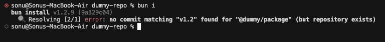

# dummy-repo

## Issue Description

When updating a git dependency installed via Bun, the `bun install` (or `bun i`) command may fail to recognize the latest changes (commits, tags, or branches) in the remote repository.

### Reproduction Steps:

1.  Add a package (e.g., [@dummy/package](https://github.com/SonuMondal06/dummy-package)) as a direct git dependency to `package.json`, referencing a specific commit hash, tag, or branch.

    *Example (`package.json`):*
    ```json
    {
      "dependencies": {
        "@dummy/package": "git+ssh://git@github.com/SonuMondal06/dummy-package.git#v1.1"
      }
    }
    ```

2.  Run `bun install`.

3.  Publish a new version (commit/tag) of the [@dummy/package](https://github.com/SonuMondal06/dummy-package) to its git repository.

4.  Update the reference in `package.json` to point to the new version.

    *Example (`package.json`):*
    ```json
    {
      "dependencies": {
        "@dummy/package": "git+ssh://git@github.com/SonuMondal06/dummy-package.git#v1.2"
      }
    }
    ```

5.  Run `bun install` again.

6.  You might encounter an error similar to this, indicating the new version wasn't found:

    

    (You can see the state of this repository leading to this error in the `error` branch.)

## Workaround

To resolve this, you can clear the Bun package manager cache before installing:

1.  Run the command:
    ```bash
    bun pm cache rm
    ```
2.  Run the installation command again:
    ```bash
    bun install
    ```

> **Note:** This issue likely occurs because Bun's cache might create a "snapshot" of the git repository's state during the initial installation. Clearing the cache forces Bun to fetch the latest updates from the remote repository.
